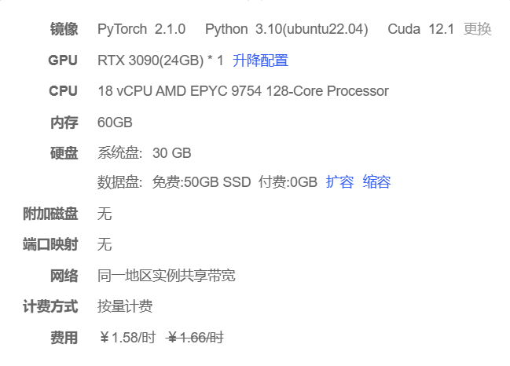
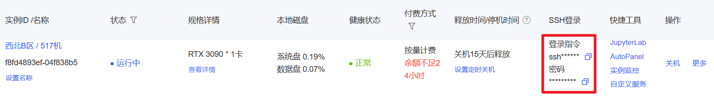
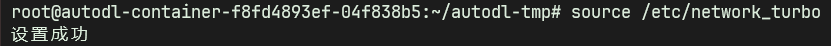
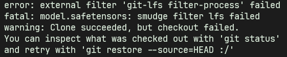
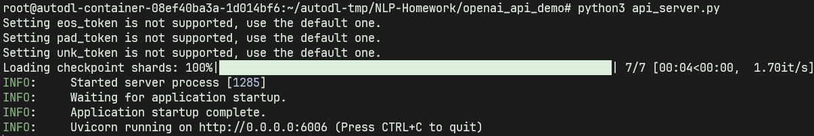

# ChatGLM3-6B部署指北（AutoDL版本）

## 部署前言

由于本人在本机的 conda 环境下部署时报 `flash attention warning`，导致推理速度极慢，怀疑是安装的 torch 版本有问题，后在 Docker 容器镜像环境下部署，却产生了不可预料的错误，Docker 进程直接被杀死。  

~~百般尝试后发现：即使是在 4-bit 量化下， ChatGLM3-6B 模型部署仍需要 4.5GB+ 的显存，而本人的 RTX 3050 仅有 4GB 显存，且还有其它程序占用，极有可能就是导致推理速度慢的罪魁祸首，遂放弃本机部署的方案 :sob: ，转而针对 AutoDL 图形服务器租赁平台进行部署。~~

后发现并成功部署 `chatglm.cpp` 量化加速部署方案，可大幅降低显存使用或直接在CPU上部署，且推理速度获得了大幅度提高。具体参考 [ChatGLM3 chatglm.cpp加速部署指北](./resource/chatglmcpp.md)

## 部署指北

### 显卡选择和镜像拉取

由于服务器租赁平台不同显卡的 CUDA 版本有所限制，而其 PyTorch2.1.0镜像（最低部署要求镜像） 仅支持 CUDA12.1 以上的显卡，综合考虑成本、便利和性能因素，本次选择 RTX 3090 作为本次部署的平台。（可自行选择，不做硬性要求，只需手动升级 PyTorch 版本在 2.1.0 以上即可）



### SSH远程登录和配置

利用AutoDL给出的登录指令和登录密码，可在Windows或其他终端上快速登录并访问云服务器上的容器终端。



由于我们需要用到Git仓库，所以在成功登录远程终端后，输入以下指令进行代理：

```shell
resource /etc/network_turbo
```

这是AutoDL官方提供的学术资源加速方法。



### 项目拉取和环境搭建

使用 `cd` 命令切换到 `/root/autodl-tmp` 路径下使用以下命令拉取本项目：

```shell
git clone https://github.com/MaLaNg116/NLP-Homework.git
```

拉取完成后再次使用 `cd` 命令，切换到 `/root/autodl-tmp/NLP-Homework` 目录下，运行以下命令搭建运行环境：

```shell
pip3 install -r requirements.txt
```

### 模型拉取

由于AutoDL的代理速度并不是很快，所以我们采取自主下载模型的方式，使用 `cd` 命令切换到 `/root/autodl-tmp/NLP-Homework/models` 目录下，首先运行：
```shell
unset http_proxy && unset https_proxy
```
用以取消学术加速，之后运行：
```shell
apt update && apt install git-lfs -y
```
用以更新工具包并安装 `git lfs` ，接着运行：
```shell
git clone https://www.modelscope.cn/ZhipuAI/chatglm3-6b.git chatglm3-6b-models
```
从魔塔社区下载 ChatGLM3-6B 模型（此时终端会稍微卡一下，表明正在下载模型，可以重新启动一个终端并利用 `du -sh /root/autodl-tmp/NLP-Homework/models/chatglm3-6b-models` 命令实时监听下载进度，因为包含 .git 文件，总大小大概 47G 左右）
由于此次模型接口提供方案来自 ChatGLM3 的 官方Demo ，所以还需下载 官方Demo 中所需要的嵌入模型，接着运行：
```shell
git clone https://www.modelscope.cn/Xorbits/bge-large-zh-v1.5.git bge-large-zh-v1.5
```
:sob: 此时如果产生了如下的错误信息 :sob:



可执行以下命令解决（注意在执行 `git pull` 时，因为 AutoDL 的数据存储空间有限制，如果遇到了空间不够的情况，可到 `chatglm3-6b` 模型路径下将 `.git` 文件删除，此操作可释放大约 20G 的存储空间）：
```shell
// 跳过文件混合（smudge）过程 - 我们稍后将以更快的批处理方式下载二进制文件安装 Git LFS
// 但在检出文件时不自动下载大文件的内容，这样可以加快克隆仓库的速度。
git lfs install --skip-smudge

// 在这里执行 git 克隆操作 克隆 Git 仓库到本地
// 由于前面指定了 --skip-smudge，这一步会很快，因为它不会下载 LFS 文件的实际内容。
git clone ...

// 在新克隆的仓库中获取所有二进制文件 现在仓库已经被克隆
// 这个命令会下载所有 LFS 跟踪的大文件
// 因为这是在仓库克隆完成后单独执行的，所以可以更有效地管理下载过程。
git lfs pull

// 恢复文件混合（smudge）过程 重新安装 Git LFS，并启用自动下载大文件内容的选项
// --force 标志会覆盖之前的设置，确保 LFS 的正常功能。
git lfs install --force
```

### 配置API服务器

官方已经推出了 OpenAI / ZhipuAI 格式的 开源模型 API 部署代码，可以作为任意基于 ChatGPT 的应用的后端。  

利用 `cd` 命令切换到 `/root/autodl-tmp/NLP-Homework/openai_api_demo` 路径下，确保你的 `api_server.py` 中的模型路径已被正确配置（可使用 vim 等工具修改），如果一切准备就绪，在终端中运行

```sh
python3 api_server.py
```



看到以上运行日志，代表 API 服务已成功在 6006 端口拉起。

同时，官方也提供了示例代码，用来测试API调用的性能。

+ OpenAI 测试脚本：[openai_api_request.py](openai_api_demo/openai_api_request.py)
+ ZhipuAI 测试脚本：[zhipu_api_request.py](openai_api_demo/zhipu_api_request.py)
+ 使用Curl进行测试

```shell
curl -X POST "http://127.0.0.1:6006/v1/chat/completions" \
-H "Content-Type: application/json" \
-d "{\"model\": \"chatglm3-6b\", \"messages\": [{\"role\": \"system\", \"content\": \"You are ChatGLM3, a large language model trained by Zhipu.AI. Follow the user's instructions carefully. Respond using markdown.\"}, {\"role\": \"user\", \"content\": \"你好，给我讲一个故事，大概100字\"}], \"stream\": false, \"max_tokens\": 100, \"temperature\": 0.8, \"top_p\": 0.8}"
```

+ 使用Python进行测试

```shell
cd openai_api_demo
python openai_api_request.py
```

如果测试成功，则模型应该返回一段故事。

### 调用RemoteLLM

使用 `cd` 命令切换到 `/root/autodl-tmp/NLP-Homework/remote/configs` 路径下，新建 `.env` 文件，用以配置你的API_KEY和模型代理地址，需要包含以下字段

```
ZHIPU_API_KEY = "EMPTY"
ZHIPU_BASE_URL = "http://127.0.0.1:6006"
OPENAI_API_KEY = "<YOUR_API_key>"
OPENAI_BASE_URL = "<YOUR_BASE_URL>"
```

在终端中运行

```shell
pip3 install python-dotenv
```

安装完成后使用 `cd` 命令切换到 `/root/autodl-tmp/NLP-Homework/remote` 路径下，在终端中运行

```shell
python3 ChatGLM3.py
```
或
```shell
python3 ChatGPT.py
```

即可以接口形式调用本地部署的 ChatGLM3-6B 了，本次部署完成


### 建立SSH隧道实现本地代理

如果你不想将API_KEY等隐私信息上传到云端，你可以参考 [AutoDL SSH隧道代理](https://www.autodl.com/docs/ssh_proxy/) ，从而让本地计算机代理远程API服务，通过本地访问 6006 端口实现接口调用（ AutoDL 官方提供的 6006 端口域名服务有问题，必须使用 SSH 隧道代理）

## 低成本部署

### 模型量化

默认情况下，模型以 FP16 精度加载，运行上述代码需要大概 13GB 显存。如果你的 GPU 显存有限，可以尝试以量化方式加载模型，使用方法如下：

```python
model = AutoModel.from_pretrained("THUDM/chatglm3-6b", trust_remote_code=True).quantize(4).cuda()
```

模型量化会带来一定的性能损失，经过测试，ChatGLM3-6B 在 4-bit 量化下仍然能够进行自然流畅的生成。

### CPU 部署

如果你没有 GPU 硬件的话，也可以在 CPU 上进行推理，但是推理速度会更慢。使用方法如下（需要大概 32GB 内存）

```python
model = AutoModel.from_pretrained("THUDM/chatglm3-6b", trust_remote_code=True).float()
```

### Mac 部署

对于搭载了 Apple Silicon 或者 AMD GPU 的 Mac，可以使用 MPS 后端来在 GPU 上运行 ChatGLM3-6B。需要参考 Apple
的 [官方说明](https://developer.apple.com/metal/pytorch) 安装 PyTorch-Nightly（正确的版本号应该是2.x.x.dev2023xxxx，而不是
2.x.x）。

目前在 MacOS 上只支持[从本地加载模型](README.md#从本地加载模型)。将代码中的模型加载改为从本地加载，并使用 mps 后端：

```python
model = AutoModel.from_pretrained("your local path", trust_remote_code=True).to('mps')
```

加载半精度的 ChatGLM3-6B 模型需要大概 13GB 内存。内存较小的机器（比如 16GB 内存的 MacBook
Pro），在空余内存不足的情况下会使用硬盘上的虚拟内存，导致推理速度严重变慢。

### 多卡部署

如果你有多张 GPU，但是每张 GPU 的显存大小都不足以容纳完整的模型，那么可以将模型切分在多张GPU上。首先安装
accelerate: `pip install accelerate`，然后即可正常加载模型。
<br/>

### 更多部署详细方式请参考 [ChatGLM3官方仓库](https://github.com/THUDM/ChatGLM3)