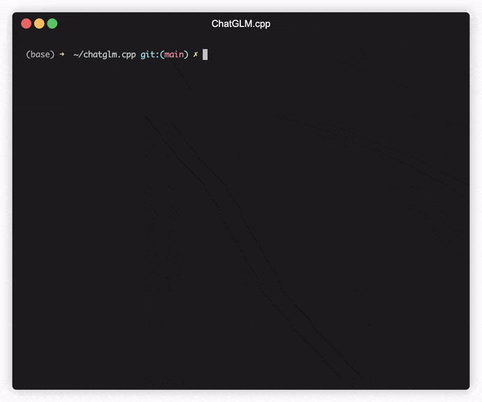

# ChatGLM3 chatglm.cpp加速部署指北

[](https://github.com/li-plus/chatglm.cpp/actions/workflows/cmake.yml)
[](https://github.com/li-plus/chatglm.cpp/actions/workflows/python-package.yml)
[](https://pypi.org/project/chatglm-cpp/)

[](LICENSE)

## ChatGLM.cpp介绍

这是对一系列大型语言模型（LLMs）的C++实现，包括 [ChatGLM-6B](https://github.com/THUDM/ChatGLM-6B), [ChatGLM2-6B](https://github.com/THUDM/ChatGLM2-6B), [ChatGLM3-6B](https://github.com/THUDM/ChatGLM3) 等，用于在您的笔记本上进行实时聊天。



## 功能特点

亮点：
+ 基于 [ggml](https://github.com/ggerganov/ggml) 的纯C++实现，工作方式与 [llama.cpp](https://github.com/ggerganov/llama.cpp) 相同。
+ 通过int4/int8量化、优化的KV缓存和并行计算加速了内存高效的CPU推理。
+ 流式生成，打字机效果。
+ 提供Python绑定、网页演示、API服务器等多种可能性。

支持：
+ 硬件：x86/arm CPU, NVIDIA GPU, Apple Silicon GPU
+ 平台：Linux, MacOS, Windows
+ 模型：[ChatGLM-6B](https://github.com/THUDM/ChatGLM-6B), [ChatGLM2-6B](https://github.com/THUDM/ChatGLM2-6B), [ChatGLM3-6B](https://github.com/THUDM/ChatGLM3), [CodeGeeX2](https://github.com/THUDM/CodeGeeX2), [Baichuan-13B](https://github.com/baichuan-inc/Baichuan-13B), [Baichuan-7B](https://github.com/baichuan-inc/Baichuan-7B), [Baichuan-13B](https://github.com/baichuan-inc/Baichuan-13B), [Baichuan2](https://github.com/baichuan-inc/Baichuan2), [InternLM](https://github.com/InternLM/InternLM)

**注意**：Baichuan & InternLM模型系列已不再推荐使用，转而推荐使用 [llama.cpp](https://github.com/ggerganov/llama.cpp)。

## 部署指北

**部署前准备**

+ 确保你已通过 [Microsoft Visual Studio](https://visualstudio.microsoft.com/zh-hans/downloads/) 正确配置桌面 C++ 开发环境
+ 确保你已正确安装配置 [CMake](https://cmake.org/)
+ 确保你已正确安装 [CUDA Toolkit](https://developer.nvidia.com/cuda-toolkit)
+ 确保你已正确安装 [HuggingFace Cli](https://huggingface.co/docs/huggingface_hub/main/en/guides/cli)

:exclamation: :exclamation: :exclamation: 如果你已正确完成以上配置，在编译文件时 CMake 指令仍然报告找不到CUDA环境的错误，可参考 [cmake报告找不到CUDA环境@Windows VC2022](https://blog.csdn.net/weixin_36829761/article/details/136896036) 

**项目拉取**

拉取 ChatGLM.cpp 项目到本地
```sh
git clone --recursive https://github.com/li-plus/chatglm.cpp.git && cd chatglm.cpp
```
如果在克隆仓库时忘记了 --recursive 标志，请在 chatglm.cpp 文件夹中运行以下命令：
```sh
git submodule update --init --recursive
```

:exclamation: :exclamation: :exclamation: 如果你在拉取项目时遇到了问题，可尝试：
+ 提供更为稳定的国际网络访问体验
+ 尝试使用 SSH 代替 HTTP 拉取
+ 如果是 [Git clone fetch-pack unexpected disconnect while reading sideband packet](https://blog.csdn.net/m0_37196398/article/details/129993150) 错误，参考博客

**模型量化**

由于量化的过程比较缓慢，且有可能量化失败，所以我们此次部署采取直接从HuggingFace拉取他人量化好的模型，此处我选择的模型是 `kingzzm/chatglm3-6b-ggml`
```sh
huggingface-cli download --resume-download kingzzm/chatglm3-6b-ggml --local-dir chatglm3-6b-ggml
```

:exclamation: 下载好后请将模型名字改成 `chatglm-ggml.bin ` (或者其他你想改的名字，此处仅是为了后面方便 copy 命令)

如果你想要自行量化模型，参考 <a href="#:books:模型量化">:books:模型量化</a>

**编译**

用 CMake 指令编译源码：
```sh
cmake -B build
cmake --build build -j --config Release
```
此编译版本为 CPU 版本，如果你需要 CUDA 加速，则需要使用 cuBLAS 加速框架：
```sh
cmake -B build -DGGML_CUBLAS=ON && cmake --build build -j
```

默认情况下，所有内核都将为所有可能的CUDA架构编译，这需要一些时间。要在特定类型的设备上运行，您可以指定 `CUDA_ARCHITECTURES` 以加快nvcc编译的速度。例如：
```sh
cmake -B build -DGGML_CUBLAS=ON -DCUDA_ARCHITECTURES="80"       # for A100
cmake -B build -DGGML_CUBLAS=ON -DCUDA_ARCHITECTURES="70;75"    # compatible with both V100 and T4
```

要找出您的GPU设备的CUDA架构，请参阅 [Your GPU Compute Capability](https://developer.nvidia.com/cuda-gpus)。

**启动**

现在你可以运行以下命令和量化后的ChatGLM3-6B模型对话：
```sh
./build/bin/Release/main -m chatglm-ggml.bin -p 你好
# 你好👋！我是人工智能助手 ChatGLM-6B，很高兴见到你，欢迎问我任何问题。
```

要以交互模式运行模型，请添加 -i 标志。例如：
```sh
./build/Release/bin/main -m chatglm-ggml.bin -i
```
在交互模式下，您的聊天历史将作为下一轮对话的上下文。

运行 `./build/bin/main -h` 来探索更多选项！

### API 服务

支持各种API服务器以与流行的前端集成。可以通过以下命令安装额外的依赖
```sh
pip install chatglm-cpp[api]
```
记得添加相应的 `CMAKE_ARGS` 以启用加速。

**LangChain API**

启动一个 LangChain API 服务器：
```sh
MODEL=./chatglm2-ggml.bin uvicorn chatglm_cpp.langchain_api:app --host 127.0.0.1 --port 6006
```

使用 `curl` 命令测试你的端点：
```sh
curl http://127.0.0.1:6006 -H 'Content-Type: application/json' -d '{"prompt": "你好"}'
```

使用 `LangChain` 运行:
```python
>>> from langchain.llms import ChatGLM
>>> 
>>> llm = ChatGLM(endpoint_url="http://127.0.0.1:8000")
>>> llm.predict("你好")
'你好👋！我是人工智能助手 ChatGLM2-6B，很高兴见到你，欢迎问我任何问题。'
```

**OpenAI API**

启动一个与 [OpenAI聊天补全协议](https://platform.openai.com/docs/api-reference/chat) 兼容的API服务器：
```sh
MODEL=./chatglm3-ggml.bin uvicorn chatglm_cpp.openai_api:app --host 127.0.0.1 --port 6006
```

使用 `curl` 命令测试你的端点：
```sh
curl http://127.0.0.1:6006/v1/chat/completions -H 'Content-Type: application/json' \
    -d '{"messages": [{"role": "user", "content": "你好"}]}'
```

使用 `OpenAI client` 和你的模型聊天:
```python
>>> from openai import OpenAI
>>> 
>>> client = OpenAI(base_url="http://127.0.0.1:6006/v1")
>>> response = client.chat.completions.create(model="default-model", messages=[{"role": "user", "content": "你好"}])
>>> response.choices[0].message.content
'你好👋！我是人工智能助手 ChatGLM3-6B，很高兴见到你，欢迎问我任何问题。'
```

至此，可利用 `RemoteLLM` 类，通过本地 `6006` 端口与你的模型聊天。

如果要使用流式回复，参考以下脚本：
```sh
OPENAI_BASE_URL=http://127.0.0.1:6006/v1 python3 examples/openai_client.py --stream --prompt 你好
```

支持 `Tool calling` ：
```sh
OPENAI_BASE_URL=http://127.0.0.1:6006/v1 python3 examples/openai_client.py --tool_call --prompt 上海天气怎么样
```

使用这个API服务器作为后端，ChatGLM.cpp模型可以无缝集成到任何使用OpenAI风格API的前端中，包括 [mckaywrigley/chatbot-ui](https://github.com/mckaywrigley/chatbot-ui), [fuergaosi233/wechat-chatgpt](https://github.com/fuergaosi233/wechat-chatgpt), [Yidadaa/ChatGPT-Next-Web](https://github.com/Yidadaa/ChatGPT-Next-Web)，等等。


### :books:模型量化

安装用于加载和量化Hugging Face模型的必要包：
```sh
python3 -m pip install -U pip
python3 -m pip install torch tabulate tqdm transformers accelerate sentencepiece
```

使用 `convert.py` 将 ChatGLM-6B 转换为量化后的 GGML 格式。例如，将 fp16 格式的原始模型转换为 q4_0（量化为int4）的GGML模型，运行：
```sh
python3 chatglm_cpp/convert.py -i THUDM/chatglm-6b -t q4_0 -o chatglm-ggml.bin
```

原始模型（ `-i <model_name_or_path>` ）可以是 Hugging Face 模型名称或您预先下载的模型的本地路径。目前支持以下模型:
* ChatGLM-6B: `THUDM/chatglm-6b`, `THUDM/chatglm-6b-int8`, `THUDM/chatglm-6b-int4`
* ChatGLM2-6B: `THUDM/chatglm2-6b`, `THUDM/chatglm2-6b-int4`
* ChatGLM3-6B: `THUDM/chatglm3-6b`
* CodeGeeX2: `THUDM/codegeex2-6b`, `THUDM/codegeex2-6b-int4`
* Baichuan & Baichuan2: `baichuan-inc/Baichuan-13B-Chat`, `baichuan-inc/Baichuan2-7B-Chat`, `baichuan-inc/Baichuan2-13B-Chat`

您可以通过指定 `-t <type>` 尝试以下任何量化类型：
* `q4_0`: 4-bit integer quantization with fp16 scales.
* `q4_1`: 4-bit integer quantization with fp16 scales and minimum values.
* `q5_0`: 5-bit integer quantization with fp16 scales.
* `q5_1`: 5-bit integer quantization with fp16 scales and minimum values.
* `q8_0`: 8-bit integer quantization with fp16 scales.
* `f16`: half precision floating point weights without quantization.
* `f32`: single precision floating point weights without quantization.

对于LoRA模型，请添加 `-l <lora_model_name_or_path>` 标志以将您的LoRA权重合并到基础模型中。

### 更多部署方法参考 [ChatGLM.cpp官方仓库](https://github.com/li-plus/chatglm.cpp/tree/main)